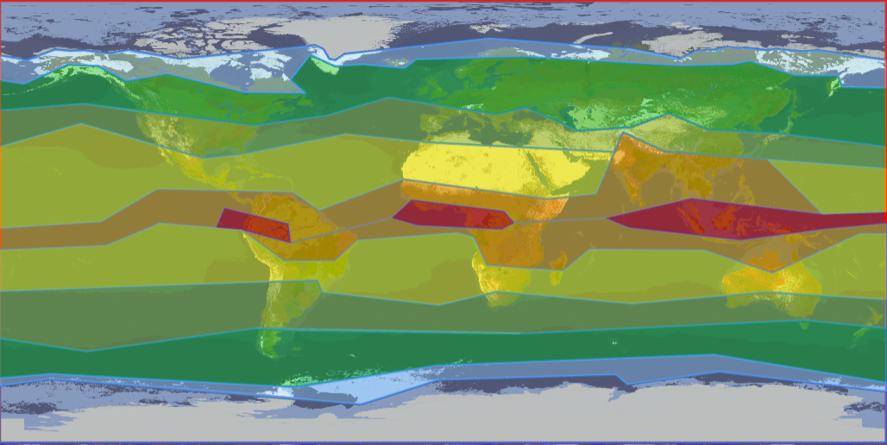

# Climate
Climates are regions of the world that have different seasons and temperatures.

---

## Climate Map
### Map Legend
**Dark Blue:** Arctic/Antarctic\
**Light Blue:** Sub-Arctic/Sub-Antarctic\
**Dark Green:** Temperate\
**Light Green:** Sub-Tropical\
**Yellow:** Tropical\
**Orange:** Sub-Equator\
**Red:** Equator

---

## Climate Effects
### Temperatures
There are two types of temperature effects a climate can have: permanent temperatures and modifiers.

Below is the permanent temperatures table. All climates below only have two possible seasons. Additionally, they have set temperatures for each season (meaning any modifiers will not affect your temperatures if you are in these climates).

| Climate                     | Winter                  | Winter Dates | Summer                 | Summer Dates |
| --------------------------- | ----------------------- | ------------ | ---------------------- | ------------ |
| Arctic/Antarctic            | -24&deg;C / -11.2&deg;F | AUG02-APR01  | 1&deg;C   / 33.8&deg;F | APR02-AUG01  |
| Sub-Antarctic/Sub-Antarctic | -6&deg;C  / 21.2&deg;F  | OCT02-MAR01  | 3&deg;C   / 37.4&deg;F | MAR02-OCT01  |
| Equator                     | 25&deg;C  / 77&deg;F    | NOV02-FEB01  | 25&deg;C  / 77&deg;F   | FEB02-NOV01  |

Below is the modifiers table. All climates below have four possible seasons. Additionally, they have climate modifiers that can stack with other temperature modifiers (like biome and armor).

| Climate      | Modifier               |
| ------------ | ---------------------- |
| Temperate    | -3&deg;C / -5.4&deg;F  |
| Sub-Tropical | NONE                   |
| Tropical     | +5&deg;C / +9&deg;F    |
| Sub-Equator  | +7&deg;C / +12.6&deg;F |